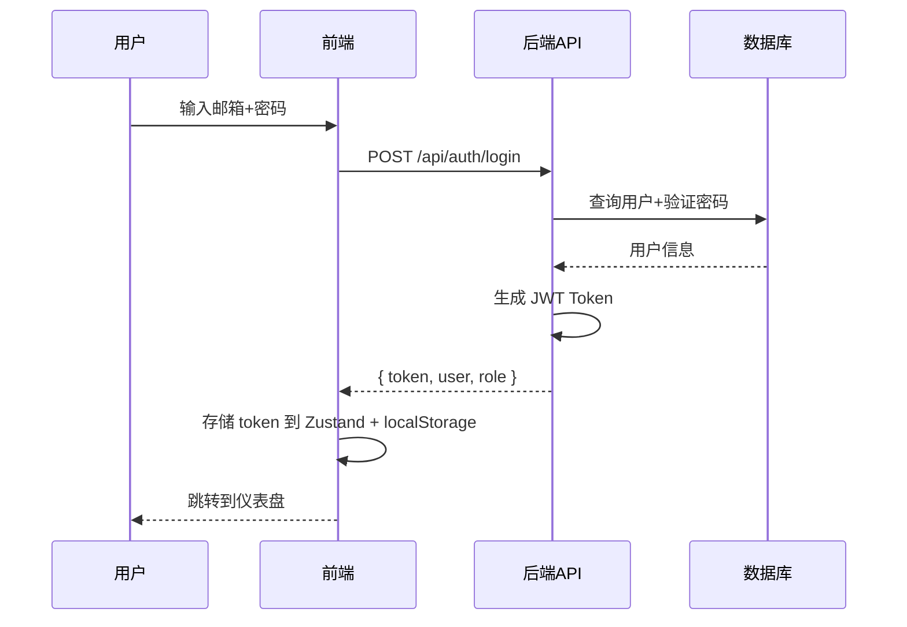
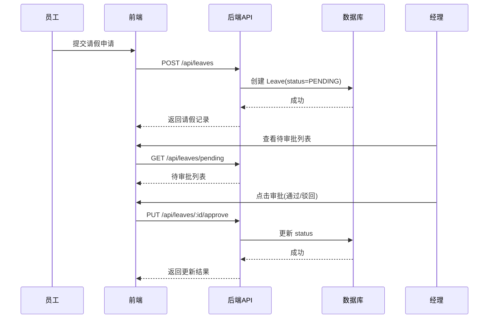
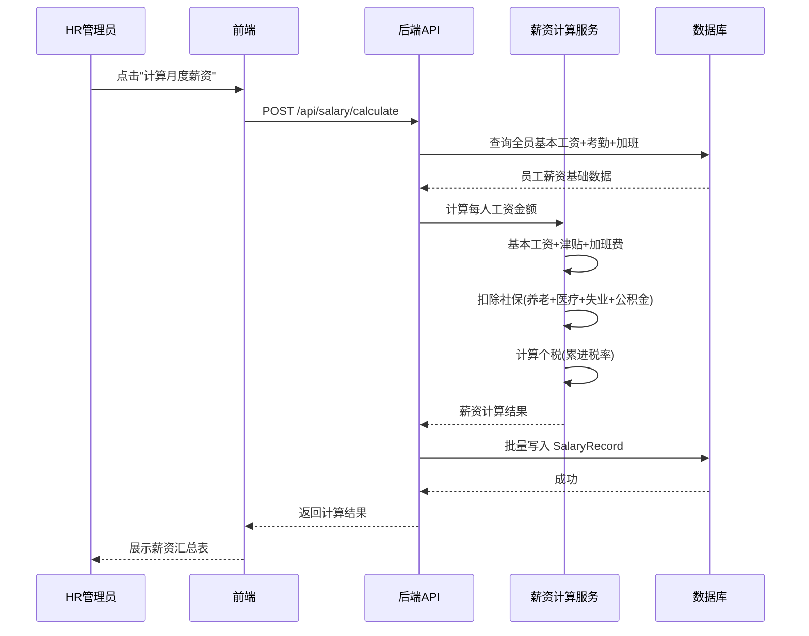

# 人力资源管理系统（HRMS）系统架构设计

**文档版本**：v1.0  
**创建日期**：2026-06-02  
**架构师**：高见远（Gao）

---

## 一、实现方案与框架选型

### 1.1 整体架构
采用 **前后端分离** 的 B/S 架构：

```
┌─────────────┐     ┌─────────────┐     ┌─────────────┐
│   Frontend   │────▶│   Backend    │────▶│   Database   │
│  React SPA   │     │  Node.js API │     │   SQLite     │
└─────────────┘     └─────────────┘     └─────────────┘
```

### 1.2 技术栈

| 层级 | 技术 | 理由 |
|------|------|------|
| 前端框架 | React 18 + Vite | 生态成熟、开发效率高 |
| UI 组件库 | MUI (Material UI) v5 | 企业级组件齐全、可定制 |
| CSS 方案 | Tailwind CSS | 原子化 CSS、快速布局 |
| 状态管理 | Zustand | 轻量、简洁 |
| 路由 | React Router v6 | 标准路由方案 |
| 图表 | ECharts (echarts-for-react) | 功能强大的数据可视化 |
| HTTP 客户端 | Axios | 拦截器支持好 |
| 表单 | React Hook Form + Zod | 性能优、类型安全 |
| 后端框架 | Express.js | 轻量、灵活 |
| ORM | Prisma | 类型安全、迁移方便 |
| 数据库 | SQLite (开发) / PostgreSQL (生产) | 轻量启动、可切换 |
| 认证 | JWT + bcrypt | 无状态认证 |
| 校验 | Zod | 前后端共享 schema |

---

## 二、文件列表及相对路径

```
hrms/
├── docs/
│   ├── PRD.md
│   └── ARCHITECTURE.md
├── package.json                    # Monorepo root
├── server/                         # 后端
│   ├── package.json
│   ├── prisma/
│   │   └── schema.prisma           # 数据库模型定义
│   ├── src/
│   │   ├── index.js                # 入口文件
│   │   ├── app.js                  # Express app 配置
│   │   ├── middleware/
│   │   │   ├── auth.js             # JWT 认证中间件
│   │   │   ├── rbac.js             # 角色权限中间件
│   │   │   └── errorHandler.js     # 全局错误处理
│   │   ├── routes/
│   │   │   ├── auth.js             # 登录/登出
│   │   │   ├── employees.js        # 员工管理
│   │   │   ├── attendance.js       # 考勤管理
│   │   │   ├── leaves.js           # 请假管理
│   │   │   ├── salary.js           # 薪资管理
│   │   │   ├── recruitment.js      # 招聘管理
│   │   │   ├── performance.js      # 绩效管理
│   │   │   ├── departments.js      # 部门管理
│   │   │   ├── dashboard.js        # 仪表盘
│   │   │   └── reports.js          # 报表导出
│   │   ├── services/
│   │   │   ├── auth.service.js
│   │   │   ├── employee.service.js
│   │   │   ├── attendance.service.js
│   │   │   ├── leave.service.js
│   │   │   ├── salary.service.js
│   │   │   ├── recruitment.service.js
│   │   │   ├── performance.service.js
│   │   │   └── dashboard.service.js
│   │   └── utils/
│   │       ├── salaryCalc.js       # 薪资计算工具
│   │       └── taxCalc.js          # 个税计算工具
│   └── seed.js                     # 种子数据
├── client/                         # 前端
│   ├── package.json
│   ├── vite.config.js
│   ├── index.html
│   ├── public/
│   └── src/
│       ├── main.jsx                # 入口
│       ├── App.jsx                 # 根组件+路由
│       ├── theme.js                # MUI 主题配置
│       ├── store/
│       │   ├── authStore.js        # 认证状态
│       │   └── uiStore.js          # UI 状态
│       ├── hooks/
│       │   ├── useAuth.js
│       │   └── useFetch.js
│       ├── layouts/
│       │   ├── MainLayout.jsx      # 主布局(侧边栏+内容)
│       │   └── AuthLayout.jsx      # 登录布局
│       ├── pages/
│       │   ├── Login.jsx
│       │   ├── Dashboard.jsx
│       │   ├── employees/
│       │   │   ├── EmployeeList.jsx
│       │   │   ├── EmployeeDetail.jsx
│       │   │   └── EmployeeForm.jsx
│       │   ├── attendance/
│       │   │   ├── AttendanceClock.jsx
│       │   │   └── AttendanceRecords.jsx
│       │   ├── leaves/
│       │   │   ├── LeaveApply.jsx
│       │   │   ├── LeaveApproval.jsx
│       │   │   └── LeaveBalance.jsx
│       │   ├── salary/
│       │   │   ├── SalaryOverview.jsx
│       │   │   └── SalarySlip.jsx
│       │   ├── recruitment/
│       │   │   ├── JobList.jsx
│       │   │   └── CandidateList.jsx
│       │   ├── performance/
│       │   │   └── PerformanceReview.jsx
│       │   ├── departments/
│       │   │   └── DepartmentTree.jsx
│       │   └── reports/
│       │       └── Reports.jsx
│       └── components/
│           ├── ProtectedRoute.jsx
│           ├── PageHeader.jsx
│           ├── DataGrid.jsx
│           ├── StatsCard.jsx
│           └── ConfirmDialog.jsx
└── shared/
    └── schemas/
        └── validation.js           # Zod 前后端共享校验
```

---

## 三、数据结构设计（Prisma Schema）

```prisma
// 核心实体关系图
// User 1---1 Employee
// Employee N---1 Department
// Department 1---N Department (树形)
// Employee 1---N Attendance
// Employee 1---N Leave
// Employee 1---N SalaryRecord
// Employee 1---N Performance
// Job 1---N Candidate
```

### 核心模型

```prisma
model User {
  id        String   @id @default(cuid())
  email     String   @unique
  password  String
  role      Role     @default(EMPLOYEE)
  employee  Employee?
  createdAt DateTime @default(now())
  updatedAt DateTime @updatedAt
}

model Department {
  id          String       @id @default(cuid())
  name        String
  parentId    String?
  parent      Department?  @relation("DeptTree", fields: [parentId], references: [id])
  children    Department[] @relation("DeptTree")
  managerId   String?
  manager     Employee?    @relation("DeptManager", fields: [managerId], references: [id])
  employees   Employee[]   @relation("DeptEmployees")
  createdAt   DateTime     @default(now())
}

model Employee {
  id           String       @id @default(cuid())
  employeeNo   String       @unique
  name         String
  gender       Gender
  phone        String
  email        String
  position     String
  status       EmpStatus    @default(ACTIVE)
  hireDate     DateTime
  leaveDate    DateTime?
  departmentId String
  department   Department   @relation("DeptEmployees", fields: [departmentId], references: [id])
  managedDept  Department?  @relation("DeptManager")
  user         User?
  baseSalary   Float        @default(0)
  attendances  Attendance[]
  leaves       Leave[]
  salaries     SalaryRecord[]
  performances Performance[]
  contracts    Contract[]
  createdAt    DateTime     @default(now())
  updatedAt    DateTime     @updatedAt
}

model Attendance {
  id         String   @id @default(cuid())
  employeeId String
  employee   Employee @relation(fields: [employeeId], references: [id])
  date       DateTime
  clockIn    DateTime?
  clockOut   DateTime?
  status     AttStatus @default(NORMAL)
  createdAt  DateTime  @default(now())
}

model Leave {
  id          String     @id @default(cuid())
  employeeId  String
  employee    Employee   @relation(fields: [employeeId], references: [id])
  type        LeaveType
  startDate   DateTime
  endDate     DateTime
  reason      String
  status      LeaveStatus @default(PENDING)
  approverId  String?
  approver    Employee?  @relation("LeaveApprover", fields: [approverId], references: [id])
  comment     String?
  createdAt   DateTime   @default(now())
  updatedAt   DateTime   @updatedAt
}

model SalaryRecord {
  id          String   @id @default(cuid())
  employeeId  String
  employee    Employee @relation(fields: [employeeId], references: [id])
  month       String   // "2026-06"
  baseSalary  Float
  allowance   Float    @default(0)
  overtime    Float    @default(0)
  bonus       Float    @default(0)
  socialIns   Float    @default(0)
  tax         Float    @default(0)
  deduction   Float    @default(0)
  netSalary   Float
  createdAt   DateTime @default(now())
}

model Job {
  id          String     @id @default(cuid())
  title       String
  department  String
  location    String
  type        JobType
  salary      String
  description String
  status      JobStatus  @default(OPEN)
  candidates  Candidate[]
  createdAt   DateTime   @default(now())
  updatedAt   DateTime   @updatedAt
}

model Candidate {
  id        String   @id @default(cuid())
  jobId     String
  job       Job      @relation(fields: [jobId], references: [id])
  name      String
  email     String
  phone     String
  resume    String?
  stage     CandStage @default(APPLIED)
  createdAt DateTime  @default(now())
  updatedAt DateTime  @updatedAt
}

model Performance {
  id          String   @id @default(cuid())
  employeeId  String
  employee    Employee @relation(fields: [employeeId], references: [id])
  period      String   // "2026-Q2"
  kpiScore    Float
  selfRating  Float?
  mgrRating   Float?
  finalRating Float?
  comments    String?
  createdAt   DateTime @default(now())
}

model Contract {
  id         String   @id @default(cuid())
  employeeId String
  employee   Employee @relation(fields: [employeeId], references: [id])
  type       String
  startDate  DateTime
  endDate    DateTime
  createdAt  DateTime @default(now())
}

// 枚举
enum Role { SUPER_ADMIN HR_ADMIN MANAGER EMPLOYEE }
enum Gender { MALE FEMALE OTHER }
enum EmpStatus { ACTIVE INACTIVE RESIGNED }
enum AttStatus { NORMAL LATE EARLY_LEAVE ABSENT }
enum LeaveType { ANNUAL SICK PERSONAL MATERNITY OTHER }
enum LeaveStatus { PENDING APPROVED REJECTED CANCELLED }
enum JobType { FULL_TIME PART_TIME INTERNSHIP }
enum JobStatus { OPEN CLOSED }
enum CandStage { APPLIED SCREENING INTERVIEWED OFFERED HIRED REJECTED }
```

---

## 四、程序调用流程（时序图）

### 4.1 登录认证流程



### 4.2 请假审批流程



### 4.3 薪资计算流程



---

## 五、API 接口设计

### 认证
| 方法 | 路径 | 描述 |
|------|------|------|
| POST | /api/auth/login | 登录 |
| POST | /api/auth/logout | 登出 |
| GET | /api/auth/me | 获取当前用户信息 |

### 员工管理
| 方法 | 路径 | 描述 |
|------|------|------|
| GET | /api/employees | 员工列表(分页/搜索/筛选) |
| GET | /api/employees/:id | 员工详情 |
| POST | /api/employees | 创建员工 |
| PUT | /api/employees/:id | 更新员工 |
| DELETE | /api/employees/:id | 删除员工(软删除) |
| POST | /api/employees/import | 批量导入 |

### 考勤管理
| 方法 | 路径 | 描述 |
|------|------|------|
| POST | /api/attendance/clock-in | 上班打卡 |
| POST | /api/attendance/clock-out | 下班打卡 |
| GET | /api/attendance/today | 今日打卡状态 |
| GET | /api/attendance/records | 考勤记录(按月) |
| GET | /api/attendance/stats | 考勤统计 |

### 请假管理
| 方法 | 路径 | 描述 |
|------|------|------|
| POST | /api/leaves | 提交请假 |
| GET | /api/leaves | 我的请假记录 |
| GET | /api/leaves/pending | 待审批列表 |
| PUT | /api/leaves/:id/approve | 审批请假 |
| GET | /api/leaves/balance | 假期余额 |

### 薪资管理
| 方法 | 路径 | 描述 |
|------|------|------|
| POST | /api/salary/calculate | 计算月度薪资 |
| GET | /api/salary/records | 薪资记录列表 |
| GET | /api/salary/my | 我的薪资条 |
| GET | /api/salary/summary | 薪资汇总 |

### 招聘管理
| 方法 | 路径 | 描述 |
|------|------|------|
| GET | /api/jobs | 职位列表 |
| POST | /api/jobs | 发布职位 |
| PUT | /api/jobs/:id | 更新职位 |
| GET | /api/jobs/:id/candidates | 候选人列表 |
| POST | /api/candidates | 添加候选人 |
| PUT | /api/candidates/:id/stage | 更新候选人阶段 |

### 仪表盘
| 方法 | 路径 | 描述 |
|------|------|------|
| GET | /api/dashboard/stats | 概览统计数据 |
| GET | /api/dashboard/trends | 趋势数据 |

---

## 六、任务列表（按实现顺序）

### 阶段一：基础设施（依赖：无）

| # | 任务 | 产出文件 | 依赖 |
|---|------|---------|------|
| T1 | 初始化项目结构 + package.json | package.json, .gitignore | - |
| T2 | 配置 Prisma + 数据库模型 | prisma/schema.prisma | T1 |
| T3 | 种子数据 | seed.js | T2 |
| T4 | Express app 骨架 + 中间件 | app.js, middleware/*.js | T1 |
| T5 | JWT 认证服务 + 路由 | auth.service.js, auth.js | T4 |

### 阶段二：后端核心模块（依赖：阶段一）

| # | 任务 | 产出文件 | 依赖 |
|---|------|---------|------|
| T6 | 员工管理 API | employee.service.js, employees.js | T5 |
| T7 | 部门管理 API | departments.js (routes) | T5, T6 |
| T8 | 考勤管理 API | attendance.service.js, attendance.js | T5, T6 |
| T9 | 请假管理 API | leave.service.js, leaves.js | T5, T6 |
| T10 | 薪资计算 + API | salaryCalc.js, taxCalc.js, salary.service.js, salary.js | T5, T6, T8 |
| T11 | 招聘管理 API | recruitment.service.js, recruitment.js | T5 |
| T12 | 绩效管理 API | performance.service.js, performance.js | T5, T6 |
| T13 | 仪表盘 API | dashboard.service.js, dashboard.js | T6-T12 |

### 阶段三：前端框架（依赖：阶段一）

| # | 任务 | 产出文件 | 依赖 |
|---|------|---------|------|
| T14 | Vite + React 初始化 | client/ 全部配置文件 | T1 |
| T15 | MUI 主题 + 布局组件 | theme.js, MainLayout.jsx, AuthLayout.jsx | T14 |
| T16 | 认证状态 + 路由守卫 | authStore.js, ProtectedRoute.jsx, App.jsx | T14, T15 |
| T17 | 通用组件 | DataGrid.jsx, StatsCard.jsx, PageHeader.jsx, ConfirmDialog.jsx | T15 |

### 阶段四：前端业务页面（依赖：阶段二 + 阶段三）

| # | 任务 | 产出文件 | 依赖 |
|---|------|---------|------|
| T18 | 登录页 | Login.jsx | T16 |
| T19 | 仪表盘页 | Dashboard.jsx | T16, T17, T13 |
| T20 | 员工管理页面 | EmployeeList.jsx, EmployeeDetail.jsx, EmployeeForm.jsx | T17, T6 |
| T21 | 考勤管理页面 | AttendanceClock.jsx, AttendanceRecords.jsx | T17, T8 |
| T22 | 请假管理页面 | LeaveApply.jsx, LeaveApproval.jsx, LeaveBalance.jsx | T17, T9 |
| T23 | 薪资管理页面 | SalaryOverview.jsx, SalarySlip.jsx | T17, T10 |
| T24 | 招聘管理页面 | JobList.jsx, CandidateList.jsx | T17, T11 |
| T25 | 绩效+部门+报表页面 | PerformanceReview.jsx, DepartmentTree.jsx, Reports.jsx | T17, T12, T7 |

### 阶段五：集成与完善

| # | 任务 | 产出文件 | 依赖 |
|---|------|---------|------|
| T26 | 前后端联调 + 错误处理 | - | T18-T25 |
| T27 | 共享校验 Schema | shared/schemas/validation.js | T6-T12 |

---

## 七、依赖包列表

### 后端 (server/)
```json
{
  "dependencies": {
    "express": "^4.18.0",
    "@prisma/client": "^5.0.0",
    "bcryptjs": "^2.4.3",
    "jsonwebtoken": "^9.0.0",
    "cors": "^2.8.5",
    "zod": "^3.22.0",
    "multer": "^1.4.5",
    "xlsx": "^0.18.5"
  },
  "devDependencies": {
    "prisma": "^5.0.0",
    "nodemon": "^3.0.0"
  }
}
```

### 前端 (client/)
```json
{
  "dependencies": {
    "react": "^18.2.0",
    "react-dom": "^18.2.0",
    "react-router-dom": "^6.20.0",
    "@mui/material": "^5.15.0",
    "@mui/icons-material": "^5.15.0",
    "@emotion/react": "^11.11.0",
    "@emotion/styled": "^11.11.0",
    "zustand": "^4.4.0",
    "axios": "^1.6.0",
    "echarts": "^5.4.0",
    "echarts-for-react": "^3.0.0",
    "react-hook-form": "^7.48.0",
    "@hookform/resolvers": "^3.3.0",
    "zod": "^3.22.0",
    "dayjs": "^1.11.0",
    "notistack": "^3.0.0"
  },
  "devDependencies": {
    "vite": "^5.0.0",
    "@vitejs/plugin-react": "^4.2.0",
    "tailwindcss": "^3.4.0",
    "autoprefixer": "^10.4.0",
    "postcss": "^8.4.0"
  }
}
```

---

## 八、共享知识（跨文件约定）

| 约定 | 说明 |
|------|------|
| API 基础路径 | `/api/v1` |
| 分页格式 | `{ page, pageSize, total, data }` |
| 日期格式 | ISO 8601 (`2026-06-02T08:00:00.000Z`) |
| 错误格式 | `{ success: false, message: string, errors?: [] }` |
| JWT 结构 | `{ userId, role, exp }` |
| 密码策略 | bcrypt, saltRounds=10 |
| 前端状态 | Zustand store 按 domain 拆分 |
| 组件命名 | PascalCase (页面/组件), camelCase (hooks/utils) |
| 文件命名 | 页面 PascalCase.jsx, 服务 camelCase.service.js |
| 环境变量 | server/.env (DATABASE_URL, JWT_SECRET, PORT) |

---

## 九、待明确事项

| 编号 | 事项 | 影响范围 | 建议 |
|------|------|---------|------|
| A-001 | 生产数据库选型 | 部署 | 建议 PostgreSQL |
| A-002 | 文件上传存储方案 | 简历/头像 | MVP 先用本地存储，后续迁移 OSS |
| A-003 | 是否需要消息通知（邮件/站内信） | 请假审批等 | MVP 先做页面内通知 |

---

*文档结束 — 由架构师高见远输出*
